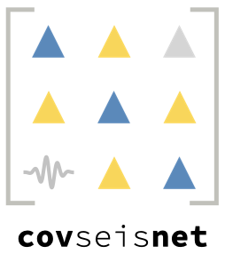

 

 
 

## Overview

This repository provides an alternative distribution of `covseisnet`, the Python
package implementing the covariance matrix methodology described in Seydoux et
al., 2016, and originally distributed at
[https://github.com/covseisnet/covseisnet](https://github.com/covseisnet/covseisnet). 

## Reference

Seydoux, Léonard, Nikolaï M. Shapiro, Julien de Rosny, Florent Brenguier, and Matthieu Landès. "Detecting seismic activity with a covariance matrix analysis of data recorded on seismic arrays." Geophysical Journal International 204, no. 3 (2016): 1430-1442. 
URL:
[https://academic.oup.com/gji/article/204/3/1430/677678](https://academic.oup.com/gji/article/204/3/1430/677678)

